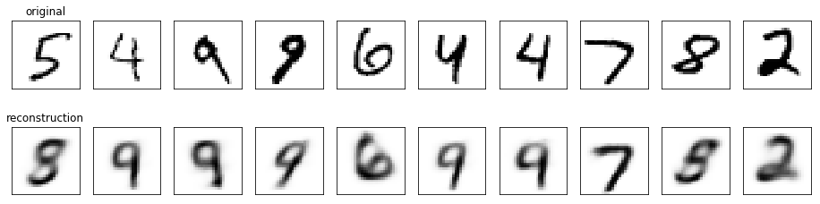

# Variational Autoencoder using MXNet
 Generating images using Variational Autoencoder with MXNet

The project was created as a part of Computer Graphics and Computer Vision course at Radboud University led by Dr U. Güçlü.
The code is written in colaboration with Rodrigo Perez Victoria and Luke Peters.

We wrote an algorithm that utilises Variational Autoencoder architecture for image generation. The neural network was written using Apache MXNet framework. We test our code on MNIST digits dataset and Fashion dataset. 

Our model can be applied to any image data

Examles of reconstraction:

Digits:

